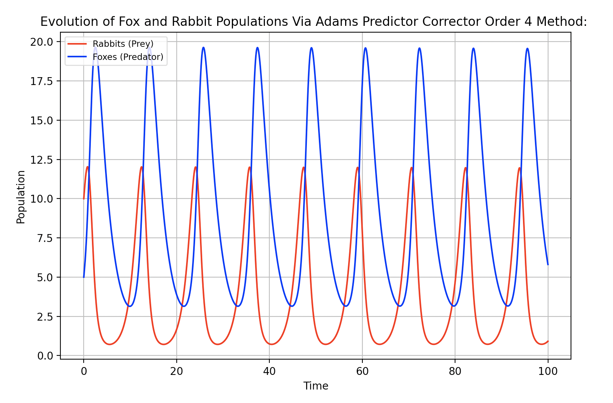

# Predator-Prey / Lotka-Volterra Equations

This script is written in Python and utilizes methods of approximating ordinary differential equations such as Runge-Kutta Order 4 (RK4), Forward Euler, and Adams Predictor Corrector Order 4 (APC4) methods, comparing to accurate SciPy Integration method, to approximate periodic solutions of the Lotka-Volterra Equations. This depicts the change of population through time within a predator-prey relationship, such as rabbits (prey) and foxes (predators), portraying the dynamics of biological systems in which the predator and prey species interact.

## Euler Method Result Graph

## RK4 Method Result Graph

## APC4 Method Result Graph

## SciPy Integration Result Graph

## Sample Output

